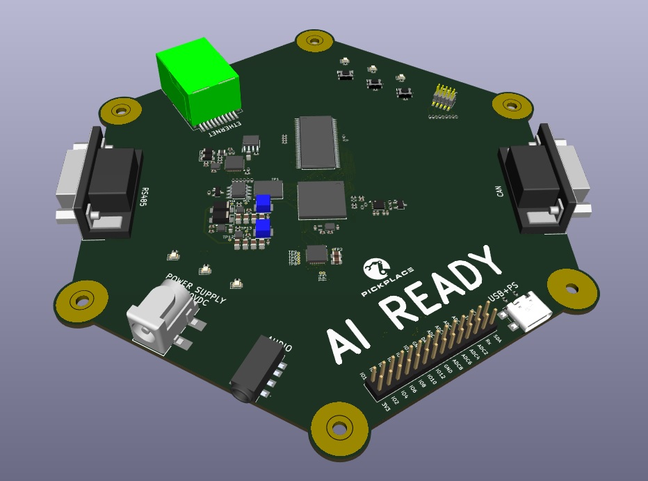

# USB-DALI
USB-DALI interface converter.
The device works as a gateway allowing sending data from USB VCP (USB Virtual COM 
Port) into DALI network and reading data from DALI network via Modbus RTU protocol.
The device can be operated via standard Modbus RTU commands set. Data exchange examples can be found below. 
Hardwrae includes DALI bus power supply.
Can be used with any other software/library supporting Modbus RTU protocol and COM port communication.
No specific USB drivers required.

## Hardware
This design (though not this very board) has been tested before and successfully used in several systems. 
The device is built around popular STM32F103C8T6 using MCUs USB. The DALI "physical layer" is build with a few descrete components without any specific transceiver.
The hardware implementation also includes DALI bus power supply which simplifies its usage in building hardware setups through design & development process. Nevertheless we don't recommend (!) using it as bus power supply in any permanent installations.

The module can work with DALI line powered from external DALI power supply or powered from 
own built-in 16V 160mA converter (powered from USB). If you are planning to use external power supply 
it’s important to open 2 jumpers on the board before connection the module to DALI network and USB. Do 
not use 2 power supplies (external and internal) at the same time! While working with both of jumpers
 open (external power supply), the module provides galvanic isolation between USB and DALI, but when 
powered from built-in power supply, DALI line has not galvanic isolation from USB.
 Being connected to USB, the module can be found in operating system as virtual COM port. It’s 
important to admit, that after connection to that port from the software, it takes MCU some time to create 
stable connection so it’s recommended to keep 3-5 seconds pause between connection and start of data 
exchange.

## Software
The device works as VCP (Virtual COM Port). When using with Linux - no drivers required. For Windows - VCP driver from ST Microelectronics should be used: 
 The Modbus address of the USB-DALI module is 0x01 (not changeable). As far as there is no possibility to connect other devices to the same USB VCP, it will be always the only device in created 
Modbus network. The real baud rate of VCP of the device is defined and limited by hardware (not software). So during usage of any software, the value of baud rate may be set to higher value (115200 is 
acceptable) while the real baud rate will be set by hardware.

## Firmware
Firmware file can be found in corresponding sub-folder and can be flashed to MCU with ST-Link (optionally J-Link).

## Protocol
For protocol description and examples look inside  

## License
This project is licensed under multiple terms:
- **Hardware (KiCad design files)**: Licensed under **CERN-OHL-W-2.0**, which allows modification and commercial use with attribution.  
- **Firmware (binary-only)**: Licensed under **Apache 2.0**, but the source code is not provided. Modification or reverse-engineering is prohibited.  
See the   for full details. 

